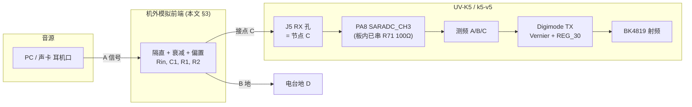

# 音频线入测频 + 本地 Digimode 发射 — 实施方案（A / B / C）

> **目标**：电脑（或其它音源）模拟音频 → 电台 **PA8 ADC** 测频 → 固件驱动 **BK4819 Vernier** 发射；**不使用** digimode UART 协议与 PC 符号钟。  
> **适用机型**：UV-K5 系列（DP32G030 + BK4819），固件树 **k5-v5**。  
> **相关文档**：[`ADC_AUDIO_FREQ_MEASUREMENT_REF.md`](ADC_AUDIO_FREQ_MEASUREMENT_REF.md)、[`external/dp32g030/PDF_SARADC_DMA_NOTES.md`](external/dp32g030/PDF_SARADC_DMA_NOTES.md)、[`DIGMODE_VERNIER_TIMING_PLAN.md`](DIGMODE_VERNIER_TIMING_PLAN.md)。

---

## 1. 系统架构



| 环节 | 说明 |
|------|------|
| 音源 | WSJT-X、任意音频、实验信号；**无** 串口 digimode 帧 |
| 模拟前端 | 隔直、衰减、中点偏置；**不能** 指望 MCU 脚直接接耳机口 |
| 测频 | 方案 A/B/C（见 §5–§7） |
| 发射 | 现有 `digimode.c` 的 `PrepareHop` / `CommitPreparedHop`；`freq_dhz` 由测频结果产生 |
| 跟踪策略 | 无外部符号钟 → **ε 稳定带 / 双 EMA + Commit 限速**（§8） |

---

## 2. 板级事实（原厂 PCB，勿当「脚直通」）

依据 UV-K5 R51 类逆向（对话与 PCB 笔记；**非** 本仓库 git 内文件）：

| 网络 | 原厂元件 | 到 MCU |
|------|----------|--------|
| 3.5 mm **RX 孔 J5** 脚 1 | **R71 100 Ω** 串联 | **PA8**（`UART1_RX` / `SARADC_CH3`） |
| PA8 附近 | **C80、C82 ≈ 210 pF** 对地 | 高频对地，**非** 音频隔直电容 |
| **TX PA7** | **R135 1 kΩ** 串 + **R134 4.7 kΩ** 上拉 **3.3 V** | 空闲高；可作 **偏置“E”** |
| PA8 RX | **无** 4.7 kΩ 上拉 | 利于 ADC 高阻输入 |

**结论**：机外必须 **隔直 + 分压/偏置**；PA8 上已有 100 Ω 与小电容，设计外接电路时把 R71 当作 **已串联 100 Ω** 的一部分。

---

## 3. 机外接线与推荐元件

### 3.1 信号定义（本文命名）

| 代号 | 含义 | 实际接点 |
|------|------|----------|
| **A** | 音源交流信号（左声道或单声道） | 电脑耳机 **Tip** |
| **B** | 音源地 | 电脑 **Sleeve**（=GND） |
| **C** | 电台 RX 模拟输入 **机外可达点** | 插入 **J5 3.5 mm RX 孔的脚 1**（板内经 R71 100 Ω 到 PA8，**不要直接焊 PA8**） |
| **D** | 电台地 | 同插孔 GND / 电池负 / J5 屏蔽圈 |
| **E** | 偏置参考（~3.3 V 高阻源） | 插入 **J6 TX 孔脚 2**（PA7 空闲高，经 R134 4.7 kΩ 上拉 3.3 V）；或独立 3.3 V 源 |

**必须**：**B 与 D 相连**（粗短地线，建议屏蔽线外皮）。  
**TRS / TRRS**：使用 **3.5 mm TRS（立体声 3 段，Sleeve=GND）** 最稳；若用 TRRS（手机 4 段），按 **CTIA**（Tip=L, R1=R, R2=GND, Sleeve=Mic）接，**E 来自电台 J6 而非耳机插头**。

### 3.2 推荐原理图（耳机口 → J5 RX）

```text
  电脑 TRS 3.5mm                 机外焊接（小盒/转接板）              电台 J5 RX 孔
  ───────────────              ─────────────────────────         ─────────────────
  Tip   (A) ─────[ Rin ]─────[ C1 ]──────┬───── 节点 N ─────────► C (J5 脚1)
                                          │                       │（板内已串 R71 100Ω 到 PA8）
                                       [ R1 ]                     │
                                          │                       │
                                          ├──── E ◄──── 来自 J6 TX 脚2（PA7 上拉 3.3V）
                                          │
                                       [ R2 ]
                                          │
  Sleeve(B) ────────────────────────────  ┴────────────────────► D (J5 GND / 电台地)

  目标：N 静息直流 ≈ 1.65 V；交流峰峰 < 1.0 V（约 ADC 1240 LSB pp，留余量）
  DC：C1 隔直，N 的 DC 仅由 E + R1/R2 决定 ≈ E×R2/(R1+R2)
  AC：源端阻抗低（耳机 ~32 Ω），N 上摆幅 ≈ V_pc × (R1∥R2) / (Rin + R1∥R2)
```

### 3.3 推荐元件数值（首版）

| 位号 | 值 | 类型 | 作用 |
|------|-----|------|------|
| **Rin** | **33 kΩ**（音量仍大可换 **47 kΩ** 或 **100 kΩ**） | 1/10 W 0805/直插 | 与 R1∥R2 形成衰减 |
| **C1** | **1 µF**（**0.47 µF~4.7 µF** 均可） | **无极性** 陶瓷 X7R / 多层；若用电解 **+** 朝 N | 隔直；下限截止 \(f_c=\frac{1}{2\pi(R_{in}+R_1\|R_2)C_1}\) |
| **R1** | **22 kΩ** | 5% | N → E，DC 偏置上拉 |
| **R2** | **22 kΩ** | 5% | N → D，DC 偏置下拉 |
| **—** | **R71 100 Ω**（**板内已有**，勿动） | — | 已在 J5→PA8 路径上，机外串大电阻即可 |

**DC 偏置**（E ≈ 3.3 V，R1=R2=22 kΩ；C1 隔直 → Rin 不参与 DC）：

\[
V_N^{\text{DC}} \approx E \times \frac{R_2}{R_1+R_2} \approx 1.65\ \text{V}
\]

**AC 衰减**（音源内阻 ≪ Rin；R1∥R2 = 11 kΩ）：

\[
\frac{V_N^{\text{AC}}}{V_{\text{pc}}} \approx \frac{R_1\|R_2}{R_{in}+R_1\|R_2} = \frac{11}{33+11} \approx 0.25
\]

典型电脑耳机口 1 Vrms 满量程 → N 约 **250 mVrms ≈ 700 mVpp**；ADC 编码差约 870 LSB pp（3.3 V 参考、12 bit），留 4 倍余量。

**低频截止**（Rin=33k, R1∥R2=11k, C1=1 µF）：约 **3.6 Hz**；C1=4.7 µF 时约 **0.8 Hz**。  
**对 1.5 kHz 音频不影响**。

**可选保护**：

| 位号 | 值 | 说明 |
|------|-----|------|
| D1 | 3.3 V TVS 或对 3.3 V 与 0 V 的钳位双肖特基 | N 对 D；勿压低线性区 |
| Cpar | **不加** 或 ≤ 100 pF | 大电容会把音频短路到地 |

### 3.4 连接器与线材

| 项目 | 建议 |
|------|------|
| 电脑端 | **3.5 mm TRS** 立体声头（Tip=L，Ring=R，Sleeve=GND）；可只用 L 或 R |
| 电台端 | 插入原厂 **3.5 mm RX 孔（J5）**；E 由 **2.5 mm TX 孔（J6）脚 2** 取出 |
| 线 | 屏蔽线，屏蔽接 **B/D**；信号芯接 **A → Rin** |
| 电脑音量 | 先 **15–25%**，观察 ADC 值或示波器无削顶再调 |

### 3.5 不推荐做法

- Tip/Ring 直接接 PA8 / 3.3 V（破坏现有偏置网络、可能损脚）  
- 用隔直电容直接把 DC 偏置推到 PA8（绕开 R71、易拾噪）  
- 音源与电台 **不共地**  
- 测频模式下保留 **UART1 RX** 占用 PA8（必须先切 PORTCON 到 SARADC_CH3）  
- 在 **digimode TX** 状态下指望 **E** 电压稳定（PA7 在发射时电平在变 → DC 漂）

### 3.6 模式互斥（必读）

| 同时进行 | 是否允许 | 原因 |
|----------|----------|------|
| 测频 + 数字音频解码（PC 侧） | ✓ | 完全允许 |
| 测频 + **本机 digimode TX** | **互斥** | ① PA7 = E，发射时 DC 不稳；② BK4819 SPI + `SYSTICK_DelayUs` 在 Commit 时段会拖垮测频；③ 大功率 TX 易耦合进 PA8 |
| 测频 + **OPA0 使能** | **禁止** | 手册 §5.21：**OPA0 的 VP=PA7、VN=PA8**，与 UART/线入方案冲突；`OPA_CFG.OPA_EN[0]` 须保持 0 |
| 测频 + 原厂 UART 烧录 / digimode 协议 | **互斥** | PA8 同脚 |
| 测频 + 电池电压采样 | **分时** | 同一 SARADC 模块，需状态机调度 |
| 测频 + 监听 RX 解调 | ✓ | BK4819 RX 不动 PA7/PA8 |

工作模式建议为状态机：**IDLE → MEASURE → STAGE → TX → MEASURE …**，**MEASURE** 与 **TX** 不同时。  
若必须近实时（边采边发），见 §8.5 半符号流水线。

---

## 4. 固件公共基础（A/B/C 共用）

### 4.1 模块划分（建议新建）

| 模块 | 职责 | 备注 |
|------|------|------|
| `board_analog_linein.c/h` | `AnalogLineIn_Enable/Disable`：PORTCON PA8→CH3、关 UART1 RX/DMA、暂停电池采样 | 提供 **Save/Restore** 旧 SARADC 配置 |
| `app/audio_freq.c/h` | 测频状态机（A/B/C 任一），输出 `f_hz_q10`、`stable`、`v_idle` | A/B/C 切换由编译开关 |
| `app/audio_digimode.c/h` | 无 UART：包络检测 → 进 TX → 按 §8 策略 `Stage/Commit` | 互斥锁定 `gDigmodeEntered` |
| 扩展 `bsp/dp32g030/saradc.h` + `hardware/dp32g030/saradc.def` | **方案 C 必需**：`ADC_FIFO_STAT`(0xA0)、`ADC_FIFO_DATA`(0xA4)、`ADC_START.FIFO_CLR` | 源：PDF §5.19、`DP32G030-extended.svd` |
| `Makefile` flag | `ENABLE_AUDIO_DIGIMODE`（默认 OFF），与 `ENABLE_DIGMODE` 互斥或共存 | 关掉时零开销 |

### 4.2 SARADC 配置基线（音频 CH3）

**注意**：`AVG` 寄存器编码与"次数"不同——`AVG_VALUE_1_SAMPLE=0`、`2=1`、`4=2`、`8=3`。下表给"次数"，写代码时用 `SARADC_CFG_AVG_BITS_1_SAMPLE` 等枚举。

| 参数 | 电池现值 | 音频测频建议 | 备注 |
|------|----------|--------------|------|
| `CH_SEL` | CH4\|CH9 | **仅 CH3** | 测频期间临时配置 |
| `AVG` | 8 次 | A：**4** 起；B：**1–2**；C：**1** | 平均次数 ↑ → 速率 ↓ |
| `CONT` | `SINGLE` | A：`SINGLE`；B/C：**`CONTINUOUS`** | 关测频时回 `SINGLE` |
| `MEM_MODE` | `CHANNEL` | A/B：`CHANNEL`；C：**`FIFO`** | C 必需 FIFO |
| `SMPL_WIN` | 15 cycle | 起步 **7–11**；提速可降到 3 | CH3 是高速通道 |
| `SMPL_SETUP` | 1 cycle | 起步 1 | 外部时钟方式才用 |
| `CLK_SEL` | DIV2（=24 MHz）| 保持 | `adc.c` 注释：位域与 TRM 不一致，先 **照搬电池路径** 再调 |
| `DMA_EN` | 0 | C：**1** | 配合 `MEM_MODE=FIFO` |
| `IE_CHx_EOC` | NONE | B1：**bit3=1**（仅 CH3） | 触发 SARADC IRQ |
| `IE_FIFO_HFULL` | NONE | B3：**1** | FIFO 8 个时中断 |

预估采样率：`f_smpl ≈ SARADC_CLK / (SMPL_WIN + 转换周期) / AVG`。CH3 + SMPL_WIN=7 + AVG=1 量级在 **数百 kHz**（实测前以此为上限）；对 1.5 kHz 测频 **绰绰有余**。

### 4.3 Digimode / Vernier

- 进音频测频模式 **同时进 digimode**（复用 `gDigmodeEntered` 显示与 PA 控制），但 **不进 UART digimode 状态机**（`UART_HandleCommand` 路径与本模式互斥）。  
- 进模式 **预填 Vernier 表 0–99**：约 100 × `VERNIER_Solve`（≈ 100 ms 量级，一次性，**不在边界做**）。  
- `freq_dhz = clamp(round((f_hz - rx_trim_hz) * 10), DHZ_MIN, DHZ_MAX)`（**通用可变频率**，**不**用 FT8 8 常数）。  
- Commit 限速：`|Δfreq_dhz| ≥ H`（默认 1）且 `now - last_commit ≥ T_min`（默认 8 ms）。  
- 换频：**先 `StageFreq`，后 `CommitPreparedHop`**（详见 [`DIGMODE_VERNIER_TIMING_PLAN.md`](DIGMODE_VERNIER_TIMING_PLAN.md)）。

### 4.4 进/退测频模式（状态保存）

```c
AnalogLineIn_Enable():
  1. 关闭 UART1 RX：UART1->CTRL &= ~RXEN
  2. 关闭 UART DMA 通道（避免 PA8 拾噪触发 DMA）
  3. ADC_Disable
  4. 保存 SARADC_CFG / IE → SRAM
  5. 重配 PORTCON PA8: UART1_RX → SARADC_CH3；PORTA_IE 关 PA8 数字输入；PU/PD=0
  5b. OPA_CFG.OPA_EN[0/1] = 0（OPA0 占用 PA7/PA8，见 PDF §5.21）
  6. 按 §4.2 重配 SARADC
  7. ADC_Enable; ADC_SoftReset
  8. (B/C) 设 NVIC_SetPriority(DP32_SARADC_IRQn, 1); NVIC_EnableIRQ
  9. gAudioMeasureActive = true

AnalogLineIn_Disable():
  1. (B/C) NVIC_DisableIRQ; ADC_Disable
  2. 还原 PORTCON PA8 → UART1_RX
  3. 还原 SARADC_CFG / IE
  4. UART1->CTRL |= RXEN; 重启 DMA CH0
  5. gAudioMeasureActive = false
```

### 4.5 与电池 ADC 互斥

同一 SARADC：`gAudioMeasureActive = true` 期间 **禁止** `BOARD_ADC_GetBatteryInfo()`。电池读数由 `APP_TimeSlice500ms` 调度，可在测频期间 **缓存上次值**，退测频再刷新。

### 4.6 NVIC 优先级建议（B / C）

DP32G030 是 Cortex-M0（无中断分组、4 级优先）。建议：

| IRQ | 优先级 | 理由 |
|-----|--------|------|
| SysTick | 0（最高） | 时间基准 |
| `DP32_SARADC_IRQn` | **1** | 采样及时性 |
| `DP32_DMA_IRQn` | **1** | C 方案半满中断 |
| `DP32_UART1_IRQn` / 其它 | 2–3 | 慢路径 |

---

## 5. 方案 A — 主循环轮询测频

### 5.1 做法

`APP_TimeSlice10ms`（10 ms 一次）里调用 `AudioFreq_PollA()`；**单次 slice 内** 集中采样一段后立刻让出，**不**整片 while(1)：

```text
AudioFreq_PollA():   /* 每 10ms 一次，最长占用 ~5ms */
  t_end = GetMicros() + WINDOW_US      /* WINDOW_US ≈ 5000 */
  while (GetMicros() < t_end):
    ADC_Start
    while (!EOC) ;
    v = ADC_GetValue(CH3)
    检测过零（v 穿过 v_idle）→ 记 GetMicros()
  按本窗内边沿算 f_hz 并喂稳定器

AudioDigimode_Poll():   /* 由 DIGMODE_Poll 调用 */
  if (stable && now - last_commit ≥ T_min):
    StageFreq(freq_dhz)
    CommitPreparedHop()
```

- 时间戳：`SCHEDULER_GetMicros()`。  
- **不** 在测频 `while` 内调用 Vernier/BK4819；Commit 在另一槽。
- WINDOW_US 太大会拖慢其它 10 ms 任务（按键/UI）；太小则采不到周期。1.5 kHz 至少要 **>= 2 ms**。

### 5.2 优点 / 缺点

| 优点 | 缺点 |
|------|------|
| 与 `board.c` / `driver/adc.c` 一致，**改动最小** | 主循环写 BK4819 时 **采样停** |
| 无需改 `start.S` 向量 | 轮询间隔受 10 ms slice 限制 |
| 适合 **第一阶段验证接线 / 阈值 / 衰减** | 与 Commit 时间窗冲突明显 |

### 5.3 实现步骤

1. `AnalogLineIn_Enable()` + LCD 显示原始 ADC / 估算频率。  
2. 调 `threshold`（约为空闲 `v_idle`）。  
3. 接 `audio_digimode_bridge`：有信号 `DoStartTx`，稳定后 Commit。  
4. 记录：CPU 占用、换频时频率跳变。

### 5.4 验收

- [ ] 静态 ADC ≈ **2048 ± 50**（N 偏置正确）。  
- [ ] 1 kHz 正弦：读数误差 **< 5 Hz**（窗内平均，5 ms 窗）。  
- [ ] 1.5 kHz 正弦：误差 **< 8 Hz**。  
- [ ] BK4819 Commit 期间出现 **可观测** 的测频中断（**预期会**，作为 B/C 改进的基线）。  
- [ ] 15–25% 音量无削顶（ADC 不贴 0/4095）。

---

## 6. 方案 B — 中断测频

### 6.1 子方案

| 子方案 | 触发链 | ISR 内容 | 适用 |
|--------|--------|----------|------|
| **B1 EOC 软触发** | `CONT=1` + CPU `ADC_START=1`；SARADC EOC IRQ | 读 `ADC_CH3_DATA`，过零判断、记时戳 | **首选**，最简单 |
| **B2a Timer ISR 软启** | Timer IRQ 里调 `ADC_Start`；CPU 等下次 EOC | 与 B1 同 | 采样间隔由 Timer 控 |
| **B2b 硬件外触发** | `ADC_TRIG=1` + `EXTTRIG_SEL[TIMER_PLUSx_GOAL]`；EOC IRQ | 与 B1 同；**无** Timer ISR | 最稳定的等间隔采样 |
| **B3 FIFO 半满** | `MEM_MODE=0` + `IE_FIFO_HFULL`；SARADC IRQ | 批量读 8 个 `ADC_FIFO_DATA` | 介于 B/C |

**Timer 资源现状**（避免冲突）：

| Timer | 占用 | 可用于音频 |
|-------|------|-----------|
| `TIMER_PLUS0` | **背光 PWM**（`SYSCON_DEV_CLK_GATE_PWM_PLUS0`） | ✗ |
| `TIMER_PLUS1` | 当前未用 | ✓ |
| `TIMER_BASE0/1/2` | 未用 | ✓（不能做 ADC 外触发） |

**B2b 推荐用 `TIMER_PLUS1`**（手册图 5-159：`EXTTRIG_SEL[11:10]` 对 `TIMER_PLUS1_GOAL[1:0]`）。

手册：§5.19 中断图 5-160；外部触发 §5.19.4（[`PDF_SARADC_DMA_NOTES.md`](external/dp32g030/PDF_SARADC_DMA_NOTES.md) §5）。

### 6.2 数据流

```text
ISR (短) → 环形缓冲 / 过零时间戳
主循环   → 算 f_hz → 稳定策略 → Stage/Commit（仅主循环）
```

### 6.3 配置要点

- 实现 `HandlerSARADC`（`start.S` 中当前为 `b .`）；保持简短：仅读寄存器 + 写环缓 + 必要时清中断。  
- `NVIC_EnableIRQ(DP32_SARADC_IRQn)`（`DP32_SARADC_IRQn = 4`，`bsp/dp32g030/irq.h`）。  
- 优先级：见 §4.6（建议 1）。  
- ISR **禁止**：BK4819 SPI、`VERNIER_Solve`、`SYSTICK_DelayUs(>1)`、任何阻塞或长循环。  
- B2 Timer 资源选择：见 §6.1 表，**优先 `TIMER_PLUS1`**。  
- 中断标志清除：写对应位（参 `adc.c`：`SARADC_IF_CHx_EOC_BITS_*`）。

### 6.4 优点 / 缺点

| 优点 | 缺点 |
|------|------|
| 测频与主循环 **解耦**（BK4819 Commit 不停采样） | 需写向量与 ISR 调试 |
| PDF + 现有 `adc.c` 框架可借鉴 | 与电池 ADC 互斥锁要严 |
| B2b 外触发采样间隔抖动 < µs 量级 | B2b 需占用 `TIMER_PLUS1` |

### 6.5 实现步骤

1. 在 A 验证接线后，开启 CH3 EOC 中断，仅 UART 日志/显示 `v`。  
2. 过零检测 + `GetMicros()` 周期缓冲。  
3. 接发射桥接 + Vernier 预填。  
4. 可选：B2 替代纯 EOC 触发。

### 6.6 验收

- [ ] **ISR 主体 < 3 µs**（B1/B2，单 `ADC_GetValue` + 比较 + 写环缓）；批量读 FIFO 的 B3 允许 < 20 µs。  
- [ ] 主循环 **整段 BK4819 SPI Commit 期间**（约 1–5 ms）ISR 仍按预期 fire（用 GPIO 翻转或计数器验证）。  
- [ ] 连续变频音频：稳定策略不误触发过多 Commit（计 `commits_per_sec`）。  
- [ ] 与 UART DMA 并发不丢字节（连接 PC 同时跑 NOOP）。

---

## 7. 方案 C — DMA + FIFO 连续采样

### 7.1 做法

```text
SARADC:
  CH_SEL    = bit3 (仅 CH3)
  MEM_MODE  = FIFO
  CONT      = CONTINUOUS
  AVG       = 1 sample (=寄存器值 0, 不平均)
  SMPL_WIN  = 7 cycle 起
  DMA_EN    = 1
  ADC_TRIG  = CPU (软启) 或 EXTERNAL (TIMER_PLUS1)

DMA_CH1:
  MSADDR   = &SARADC_FIFO_DATA   (0x400BA0A4)
  MS_SEL   = 011  (SARADC 源, 手册图 5-179)
  MS_SIZE  = 16BIT
  MS_ADDMOD= NONE
  MDADDR   = ring[]              (SRAM, 双缓冲或环形)
  MD_SEL   = SRAM (000)
  MD_SIZE  = 16BIT
  MD_ADDMOD= INCREMENT
  LENGTH   = N (建议 64 或 128)
  LOOP     = ENABLE
  CH_EN    = ENABLE

DMA_INTEN.CH1_TC_INTEN  = ENABLE  (传输完成 → 主循环消费另一半)
(可选) CH1_THC_INTEN    = ENABLE  (半完成，做双缓冲)

CPU:  从 ring 计算过零、f_hz；主循环 Stage/Commit
```

手册：**图 5-179**（PDF 约第 390 页）；`MS_SEL=011` → SARADC；FIFO **16 级**（[`PDF_SARADC_DMA_NOTES.md`](external/dp32g030/PDF_SARADC_DMA_NOTES.md) §4、§6）。

### 7.2 DMA 通道分配

| 通道 | 用途 | 备注 |
|------|------|------|
| **DMA_CH0** | **保持** UART1 RX（`driver/uart.c`） | 不改 |
| **DMA_CH1** | **SARADC FIFO → SRAM**（推荐） | 命名避免 `SARADC_CH3` 视觉混淆 |
| DMA_CH2/CH3 | 备用 / SPI 等 | — |

> **命名注意**：`DMA_CH1` 与 `SARADC_CH3` 是两个外设的通道，无关。本文 DMA 都加 `DMA_` 前缀。

### 7.3 BSP 缺口（必须先做）

从 `DP32G030-extended.svd` / PDF §5.19 寄存器映射补入：

| 文件 | 增项 |
|------|------|
| `hardware/dp32g030/saradc.def` | `ADC_FIFO_STAT = 0xA0`（位 `LEVEL[7:4]/EMPTY[2]/HFULL[1]/FULL[0]`）；`ADC_FIFO_DATA = 0xA4`（位 `NUM[15:12]/DATA[11:0]`）；`START.FIFO_CLR = bit3` |
| `bsp/dp32g030/saradc.h` | 由 `.def` 重新生成 / 手工补 SHIFT/MASK |
| `driver/adc.{c,h}` | 新增 `ADC_GetFifoLevel()`、`ADC_GetFifoData()`、`ADC_ClearFifo()` |

### 7.4 优点 / 缺点

| 优点 | 缺点 |
|------|------|
| 采样率最高，CPU 负担小 | 实现量最大 |
| 适合快变 / _dense 采样后处理 | FIFO 仅 16 深，DMA 需环缓及时消费 |
| 换频与采样 **可并行** | 需上板验证与 UART 共存 |

### 7.5 实现步骤

1. 扩展 BSP 头文件。  
2. 单通道连续 + CPU 读 FIFO 调试（暂不开 DMA）。  
3. DMA CH1 环缓 + 半满中断可选。  
4. 接入测频与 digimode 桥接。  

### 7.6 验收

- [ ] FIFO 水位（轮询 `ADC_FIFO_STAT.LEVEL`）随采样推进。  
- [ ] DMA 环缓无长期溢出（FIFO 满 → SARADC 丢新样）。  
- [ ] 同一信号下采样率显著高于方案 A/B（例如 10× 以上）。  
- [ ] 与 UART RX DMA（CH0）长时间共存无丢字节。  
- [ ] `gAudioMeasureActive` 关闭时 DMA_CH1 完全停（CH_EN=0），不再误触发。

---

## 8. 频率跟踪与发射策略（无符号钟）

不依赖 PC `SYNC_REQ` / `interval_us`；**通用 digimode**（频率连续变化）。

### 8.1 推荐：ε 稳定带 + Commit 限速（**两级**）

**层一（粗）：判稳定**——滑窗 N 个 f 估计，`max-min < ε`，持续 ≥ `T_hold` → 算 `f_target = median(f)*10`。  
**层二（细）：判提交**——`f_target` 与上次 Commit 的 `freq_dhz` 差 `≥ H`（0.1 Hz 格）且距上次 Commit `≥ T_min`，才执行 Stage+Commit。

> **量级解释**：ε **以 Hz 为单位**（用于判断"是否在变"），H **以 0.1 Hz 为单位**（用于"够不够值得换 PLL"）。差 10 倍是故意的：**粗判稳定** 容许 ±几 Hz 的真实抖动；**细判提交** 用协议原生精度。

```text
on_new_freq_estimate(f_hz):
  ring_push(f_hz)
  spread = max(ring) - min(ring)
  if spread < EPS and stable_since(spread<EPS) ≥ T_HOLD:
    f_target = round(median(ring) * 10)              # dhz
    if abs(f_target - last_committed_dhz) ≥ H
       and (now - last_commit_us) ≥ T_MIN_US:
      StageFreq(f_target)
      CommitPreparedHop()
      last_committed_dhz = f_target
      last_commit_us = now
```

| 参数 | 建议初值 | 调参 |
|------|----------|------|
| `EPS` | **5 Hz** | 噪声大调大；快变信号调小但易抖 |
| `T_HOLD` | **15 ms** | 直接决定阶跃响应延迟（连同 §B/C 测窗） |
| `H` | **1**（0.1 Hz） | 想节流 REG_30 调到 2–3（0.2–0.3 Hz） |
| `T_MIN_US` | **8000**（8 ms） | 防 BK4819 写抖；FT8 一符号 160 ms |
| 滑窗 `N` | **8** | 越大越稳但延迟越长 |

### 8.2 备选：双 EMA（跟连续变调）

- `f_slow` 大时间常数 → 驱动 `freq_dhz`；适合 **缓变** 音频。  
- 快跳会被平滑；与「块级 FSK」可混搭检测。

### 8.3 校准

| 项 | 做法 |
|----|------|
| `rx_trim_hz` | 单音 1000 Hz 实测，存 EEPROM |
| 空闲阈值 | 上电读 N 次 ADC 得 `v_idle`、噪声带 |

### 8.4 首发射

1. 包络/幅度 > 阈值（如 `peak_pp > N_PP_MIN`，例 200 LSB）持续 ≥ `T_ON`（如 30 ms）→ `DoStartTx`。  
2. 首频也走 ε / T_hold，避免噪声误发。  
3. 信号消失 → `T_OFF` 后 `DoStopTx`，避免 TX 拖尾。

### 8.5（可选）半符号流水线

若需更小延迟：把"测频窗"与"换频提交"在时间上交错：

- 时段 `[0, T_meas)`：纯采样 + 算 `f_target`  
- 时段 `[T_meas, T_meas+T_stage)`：`StageFreq`（写 38/39/3B，I/O 慢）  
- 时段边界：`CommitPreparedHop`（toggle REG_30，快）

只在 **真的换** 时才走第二三段；否则继续采样。比 8.1 多一层调度，**首版可不上**。

---

## 9. 三方案对比总表

| 维度 | **A** 主循环轮询 | **B** 中断 | **C** DMA+FIFO |
|------|--------------|--------|------------|
| 开发量 | 极小 | 中 | 大 |
| 新增模块 | `audio_freq.c` | + `HandlerSARADC` ISR | + BSP FIFO 头 + DMA |
| 采样率上限 | 受 10 ms slice 限制（实际等效几 kHz–十几 kHz） | 数十–几百 kHz | 接近硬件上限（数百 kHz–MHz 级） |
| 采样与换频并行 | **不可**（BK4819 SPI 期间停采） | **可**（ISR 持续） | **可**（DMA 完全并行） |
| 抖动 | 大（受主循环负载） | 小（ISR）或 **极小**（B2b 外触发） | 极小 |
| 文档依据 | 现有 `driver/adc.c` | PDF §5.19 + 空 `HandlerSARADC` | PDF 图 5-179 + extended SVD FIFO |
| 主要风险 | 换频丢样、延迟大 | ISR/Timer 冲突 | BSP 缺、DMA 上板 |
| 建议阶段 | **接线/阈值/算法首验** | **生产主路径** | 性能不足时再上 |

---

## 10. 推荐实施顺序

```text
阶段 0  硬件：按 §3 焊小转接板 → 万用表测 N ≈ 1.65 V
        → 信号发生器 1 kHz/300 mVpp → 示波器看 N 波形干净
阶段 1  方案 A：LCD 显示原始 ADC、估算频率；调阈值 v_idle
阶段 2  方案 B1：实现 HandlerSARADC + 过零环缓 + Vernier 预填
        → §8 ε/T_hold 跟踪 → 与 Digimode TX 串起来本地自收发
阶段 3  实机调 EPS / T_HOLD / T_MIN / H；逻辑分析仪量 commit_rate
阶段 4  （按需）B2b 外触发 → 稳定采样率
阶段 5  （按需）方案 C：BSP FIFO 头 → CPU 读 FIFO → DMA_CH1 环缓
```

**不要** 跳过阶段 0–1 直接 B/C；接线没对，软件再好也没用。

### 10.1 测试设备清单

| 必备 | 用途 |
|------|------|
| 万用表 | 测 N 偏置、E 电压 |
| 信号发生器（或电脑 + Audacity 生成正弦） | 1 kHz/1.5 kHz/扫频测试 |
| 推荐 | |
| 示波器（≥ 20 MHz） | N 波形、ADC 触发、GPIO 翻转标记 |
| 逻辑分析仪 | DMA/UART/BK4819 SPI 时序 |
| 另一台对讲机或 SDR | 接收本机发射 |

---

## 11. 测试计划

| # | 项 | 方法 | 通过标准 |
|---|-----|------|----------|
| T1 | 静态偏置 | 万用表 N 对 D | **1.55–1.75 V** |
| T2 | AC 摆幅 | 示波器；信号源 1 Vpp@1 kHz | N 摆幅 **150–350 mVpp**，无削顶 |
| T3 | ADC 静态码 | LCD/UART 输出 v | 接近 **2048 ± 50** |
| T4 | 1 kHz / 1.5 kHz 测频 | 信号源 | 误差 **< 2 Hz**（窗内平均后） |
| T5 | 扫频 100→3 kHz | 信号源 chirp | 跟随、无虚假 commit 风暴 |
| T6 | 电脑 FT8 音频 | WSJT-X 播 | 频点近 1500 Hz 附近 8 格 |
| T7 | Commit 延迟 | 阶跃音 → 量 GPIO 翻转 | **< 30 ms**（B 方案预期） |
| T8 | TX 期间 ADC | 进发射 + 大功率 | 见 §3.6；本表预期 **互斥**，不应同时跑 |
| T9 | UART 切换 | 测频模式 → 退出 → `read_eeprom.py` | UART 正常 |
| T10 | 电池采样 | 测频模式下批量 → 退出后读电 | 电压值合理 |
| T11 | 长跑 1 h | 自动信号循环 | 无死机、无 UART 丢、无 FIFO 长溢出（C） |

---

## 12. 风险与对策

| 风险 | 对策 |
|------|------|
| PA8/UART 冲突 | `AnalogLineIn_Save/Restore`；退模式恢复 UART RX + DMA |
| 削顶 / 过小 | 改 Rin、调电脑音量；T2/T3 校 |
| 静电损 PA8 | 保护二极管（§3.3 可选） + 屏蔽线 |
| Vernier 边界晚 | 进模式预填 fine 0–99；`PrepareHop` 提前 |
| 无符号钟导致发射延迟 | `T_hold` 与 `T_min` 平衡；不追求"实时" |
| CH3 与电池 ADC | `gAudioMeasureActive` 锁；电池值缓存 |
| 方案 C FIFO 溢出 | 提高 DMA 消费、减 AVG、降 `SMPL_WIN`；或回退 B3 |
| `adc.c` 注释的 `SMPL_CLK` 位域不一致 | 改分频前 **照 PDF + 上板示波器**；不要凭头文件 |
| 测频时主循环 BK4819 写卡顿 | 见 §8.5；或减少 commit 频率 |
| TX 偏置 E 在大功率下波动 | 软件 `rx_trim` 校；或用独立 3.3 V LDO 提供 E |

---

## 13. 文档与代码索引

### 13.1 文档

| 类型 | 路径 |
|------|------|
| 本计划 | `docs/AUDIO_ADC_DIGIMODE_PLAN.md` |
| B/C 技术参考 | `docs/ADC_AUDIO_FREQ_MEASUREMENT_REF.md` |
| PDF 摘录 | `docs/external/dp32g030/PDF_SARADC_DMA_NOTES.md` |
| 手册 PDF | `docs/external/dp32g030/DP32G030.pdf` |
| Digimode 时序 | `docs/DIGMODE_VERNIER_TIMING_PLAN.md` |
| 扩展 SVD | `docs/external/dp32g030/DP32G030-extended.svd` |

### 13.2 现有代码

| 类型 | 路径 |
|------|------|
| 现有 Digimode TX | `app/digmode.c`、`dsp/vernier.c` |
| 电池 ADC（CH4/CH9） | `board.c` `BOARD_ADC_*` |
| ADC 驱动 | `driver/adc.c/h` |
| UART DMA 模板 | `driver/uart.c` |
| 主循环 / 10 ms slice | `main.c`、`app/app.c` `APP_TimeSlice10ms` |
| 调度时间戳 | `scheduler.c` `SCHEDULER_GetMicros` |
| 中断向量表 | `start.S`（`HandlerSARADC` 待实现） |
| 引脚复用 | `hardware/dp32g030/portcon.def` |
| 寄存器位域 | `bsp/dp32g030/saradc.h`、`hardware/dp32g030/saradc.def` |

### 13.3 计划新增

| 路径 | 用途 | 阶段 |
|------|------|------|
| `app/board_analog_linein.c/h` | `AnalogLineIn_Enable/Disable` | 阶段 1 |
| `app/audio_freq.c/h` | 测频状态机（A/B/C） | 阶段 1–5 |
| `app/audio_digimode.c/h` | 无 UART 桥接 + 跟踪策略 | 阶段 2 |
| `app/audio_freq_isr.c`（仅 B/C） | `HandlerSARADC` / `HandlerDMA` 实体 | 阶段 2 / 5 |
| `Makefile` | `ENABLE_AUDIO_DIGIMODE` flag | 阶段 1 |

---

## 14. 修订记录

| 日期 | 说明 |
|------|------|
| 2026-05-20 | 初版：A/B/C 方案、机外电路与元件、固件模块、跟踪策略、测试与里程碑 |
| 2026-05-20 | 优化：修 §3.2 图与 C 接点；明确 §3.6 模式互斥；§4.2 AVG 编码与值区分；新增 §4.4–§4.6（状态保存 / 电池互斥 / NVIC 优先级）；§5.1 改协作式；§6.1 加 Timer 冲突表；§7.1 完整 DMA 配置；§7.2 改 `DMA_CH1` 避免命名混淆；§8.1 双层（ε vs H）说明；新增 §8.5 流水线、§10.1 设备清单；T 表加通过标准 |
