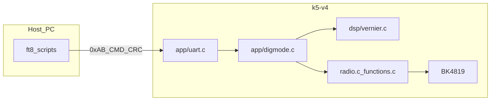

> **路径说明**：本文档位于 `k5-v4/docs/`。文中以 `../` 开头的链接相对于 **k5-v4 工程根**；以 `../../github-repo/` 开头的链接相对于 **与本仓库同级的 `github-repo` 目录**（若本地无该目录，请从计划中的远程源获取参考固件）。

# k5-v4 移植 CW 与 Digimode（自 github-repo）

## 背景与依赖关系

- **CW**（`MODULATION_CW`）是 **Digimode 的 TX 载体**：参考实现里 `START_TX` 将 VFO 设为 CW，走 `FUNCTION_Select(FUNCTION_TRANSMIT)` → `FUNCTION_Transmit()` / `RADIO_SetTxParameters()`，再关掉侧音、由 Vernier 改频（见 [github-repo/App/app/digmode.c](../../github-repo/App/app/digmode.c) 中 `DoStartTx` 注释与实现）。
- **Digimode** 协议、FIFO/定时调度、EMF 冗余与主机工具说明见 [github-repo/tools/digimode/DIGITAL_MODE.md](../../github-repo/tools/digimode/DIGITAL_MODE.md)。
- **K1 侧「三个」Python 主机程序**（须字节级兼容、**不改脚本**）：一般指 `ft8_send_batch.py`、`ft8_send_symbols.py` 与 **GUI 工具**（`tools/digimode/gui/` 下 `v1`/`v2`/`v3` 三套界面 **共用同一 UART 帧格式**，固件一致则三套 GUI 均可使用）。固件保持与 [github-repo/App/app/digmode.h](../../github-repo/App/app/digmode.h) 及参考 `digmode.c` 行为一致即可与上述全部脚本兼容。
- **射频 IC**：两树均围绕 **BK4819**；Vernier 与晶振的**可查证数据**见下文「网上可查数据与依据」。

## 网上可查数据与依据（BK4819 / 手册 / 时钟）

以下为 **2025 年前后公开网页** 可复核的摘要，用于支撑计划中 CW、Digimode、Vernier 与 `SCHEDULER_GetMicros` 的合理性；**寄存器位域与 trim 精确步进**仍以你采用的 **PDF 手册版本** 为准。

### BK4819 器件级规格（厂家产品页）

- [博通集成（Beken）BK4819 中文产品页](https://www.bekencorp.com/index/goods/detail/cid/50.html) 描述要点：
  - **定位**：半双工 TDD **FM 收发器** / 数字对讲机射频收发芯片。
  - **频段（官网文案）**：**18 MHz–620 MHz**、**840 MHz–1200 MHz**。
  - **信道间隔**：**12.5 / 25 / 6.25 / 20 kHz**。
  - **片上 RF PA**：约 **+7 dBm**。
  - **供电**：**3.0 V–3.6 V**。
  - **MCU 接口**：**三线**、时钟最高 **8 Mbps**；封装 **QFN32，4×4 mm**。
  - **其它与固件相关能力**（官网列举）：CTCSS/DCS、**DTMF**、VOX、RSSI、FSK 数据调制解调等 — 与本计划「默认关 DTMF、走 UART digimode」为**编译策略选择**，并非芯片无 DTMF。
- **频段表述差异说明**：流通 PDF（如 Alldatasheet 标注的 *Analog Two Way Radio IC Rev.1.0*）及第三方摘录中，偶见 **18–660 MHz / 840–1300 MHz** 等写法，与官网 **620 / 1200 MHz** 不完全相同。实施宽频、CW 与 PA 滤波时以 **数据手册 Rev + 实际硬件 BOM/滤波器** 为准。本仓库 [k5-v4/frequencies.c](../frequencies.c) 注释为开源 UV-K5 系常用分段（约 **18–630 MHz** 与 **760–1300 MHz**），与厂家页码区间属**同类芯片在不同文档/版本下的表述差**，移植时**不要**仅凭单一网页改频段表，除非有实测与手册依据。

### 数据手册与社区应用笔记（寄存器、26 MHz 参考）

- [Alldatasheet：Beken BK4819 PDF 索引页](https://www.alldatasheet.com/datasheet-pdf/pdf/1756567/BEKEN/BK4819.html)（标注 *Rev.1.0*，约 22 页，便于下载完整寄存器说明）。
- 社区硬件资料中常见：[amnemonic/Quansheng_UV-K5_Firmware 仓库 `hardware/` 下的 BK4819 应用笔记 PDF](https://github.com/amnemonic/Quansheng_UV-K5_Firmware)（例如 **BK4819(V3) Application Note 20210428.pdf** 等文件名；**非厂家官网**，但与 UV-K5/K5 类机寄存器实操一致，可作交叉参考）。
- **26 MHz 晶振**：多份公开资料/摘录说明 BK4819 使用 **26 MHz** 晶体作为参考振荡（并联谐振、负载电容需匹配晶振数据手册）。**REG_3B** 等 trim 的 **LSB 频率影响** 以完整手册寄存器章为准；移植用 Vernier 代码中 `VERNIER_ComputeAlpha` 采用工程式 **α_mHz/LSB ≈ 5000·f_carrier_Hz / 26 000 000**（见将迁入的 [github-repo/App/dsp/vernier.c](../../github-repo/App/dsp/vernier.c)）。若实机 sub-Hz 误差偏大，优先依赖 EEPROM `BK4819_XTAL_FREQ_LOW` 与整机 TCXO 公差校准，而非单独改 Python。

### MCU 主频与 SysTick（实现微秒时间戳）

- 公开网页对 **DP32G030** 主频的**一页式规格表**较少；本工程 [k5-v4/driver/systick.c](../driver/systick.c) 使用 `SysTick_Config(480000)` 与 `gTickMultiplier = 48`，对应 **SystemCoreClock = 48 MHz**、SysTick **重装载 480000 → 每 10 ms** 一次节拍（`SystickHandler`）的工程约定；**微秒**由 `SysTick->VAL` 在 10 ms 窗口内细分（与 [github-repo/App/scheduler.c](../../github-repo/App/scheduler.c) 中 `SCHEDULER_GetMicros` 思路一致）。实现时须与 **链接脚本/启动代码里对 SystemCoreClock 的定义**一致，否则 FT8 符号定时漂移。

### 固件频率字与 CW 收信偏置

- 与 DualTachyon 系 UV-K5 固件一致：射频频率在 API 中常用 **10 Hz 为单位**（即 `f_Hz / 10`）。CW 收信 **−650 Hz** 对应参考实现中的 `cwOffset_10Hz = 65`。

## 与参考树的主要差异（移植时必须适配）

| 项目                            | github-repo                                                                                                                    | k5-v4                                                                                                                                                                                                                               |
| ----------------------------- | ------------------------------------------------------------------------------------------------------------------------------ | ----------------------------------------------------------------------------------------------------------------------------------------------------------------------------------------------------------------------------------- |
| 构建                            | CMake + `enable_feature(ENABLE_DIGMODE …)`                                                                                     | [k5-v4/Makefile](../Makefile) `OBJS` + `ENABLE_*` 宏                                                                                                                                                                              |
| 微秒时间戳                         | [github-repo/App/scheduler.c](../../github-repo/App/scheduler.c) `SCHEDULER_GetMicros()`（SysTick 10 ms + VAL）                        | 仅有 [k5-v4/scheduler.c](../scheduler.c) 10 ms 节拍；**需新增**等价的 `SCHEDULER_GetMicros`（同样基于 `gGlobalSysTickCounter` + `SysTick->LOAD/VAL`，CPU 48 MHz 与 [k5-v4/driver/systick.c](../driver/systick.c) 的 `SysTick_Config(480000)` 一致） |
| TX 功率档位                       | UART 协议 1B：`0`=USER、`1–5`=LOW1–5、`6`=MID、`7`=HIGH、`0xFF`=当前 VFO（[DIGITAL_MODE.md](../../github-repo/tools/digimode/DIGITAL_MODE.md)） | k5-v4 仅三档；**LOW1–5→LOW，MID→MID，HIGH→HIGH**；`0`/`0xFF` 不改写功率（见上文实施步骤）                                                                                                                                                                |
| `RADIO_PrepareTX`             | 允许 `MODULATION_CW`（及可选 AM）                                                                                                     | [k5-v4/radio.c](../radio.c) 在 `!ENABLE_TX_WHEN_AM` 时仅允许 FM — **需允许 CW**（与参考一致：`!= FM && != CW` 则禁止）                                                                                                                              |
| `FUNCTION_Transmit`           | CW 专用路径（先切 FM 配置再静音 AF、650 Hz 侧音等）                                                                                             | [k5-v4/functions.c](../functions.c) 无 CW 分支 — **需移植** [github-repo/App/functions.c](../../github-repo/App/functions.c) 中 `isCw` 逻辑（依赖 `BK4819_TransmitTone` 等现有 API）                                                                   |
| `RADIO_SetModulation`         | AM 走 FM AF；USB/CW 共用 `BASEBAND2`，`REG_3D` 与 USB 相同                                                                             | k5-v4 中 AM 仍用 `BK4819_AF_AM` — **仅增加 `MODULATION_CW` 分支**（对齐参考：CW 同 USB 的 AF/`REG_3D`），勿改动现有 AM 行为                                                                                                                                  |
| `RADIO_SetupRegisters` RX 频率  | CW 时 RX LO 减 650 Hz（`cwOffset_10Hz = 65`）                                                                                      | [k5-v4/radio.c](../radio.c) 在 `BK4819_SetFrequency` 前 **插入相同偏移**                                                                                                                                                                 |
| `RADIO_SendEndOfTransmission` | CW 不走 Roger/尾音，直接恢复寄存器                                                                                                         | [k5-v4/radio.c](../radio.c) 需 **增加 CW 分支**（对齐 [github-repo/App/radio.c](../../github-repo/App/radio.c) `RADIO_SendEndOfTransmission`）                                                                                                  |
| UART 帧分流                      | 在找 `0xAB 0xCD` 协议前，若第二字节为 `0x01..0x0A` 则走 `DIGMODE_ProcessByte`（**且** 短帧不得被 CPS 的 `>=8` 门槛挡掉）                                  | [k5-v4/app/uart.c](../app/uart.c) 需 **按 §4 重构循环**（DP32G030 单 UART + `DMA_CH0->ST`，非 PY32 `LL_DMA`）                                                                                                                               |

## 实施步骤（仅改 k5-v4）

### 1. CW 调制

- [k5-v4/radio.h](../radio.h)：在 `MODULATION_USB` 后增加 `MODULATION_CW`（在 `ENABLE_BYP_RAW` 块之前，顺序与参考一致）。
- [k5-v4/radio.c](../radio.c)：`gModulationStr` 增加 `"CW"`；`RADIO_SetModulation` 增加 `case MODULATION_CW`；`RADIO_SetupRegisters` RX 频率 CW 偏移；`RADIO_PrepareTX` 允许 CW；`RADIO_SendEndOfTransmission` CW 清理。
- [k5-v4/functions.c](../functions.c)：`FUNCTION_Transmit` 移植 `isCw` 路径（与参考一致：临时 `RADIO_SetModulation(MODULATION_FM)`、再静音/侧音等 — 以参考为准保证与 Digimode 共用同一 TX 形态）。
- [k5-v4/app/menu.c](../app/menu.c) / [k5-v4/app/action.c](../app/action.c)：调制循环上限与 `gModulationStr` 下标一致（`MODULATION_UKNOWN`）。
- 可选：若希望菜单里与参考一致显示 “CW”，确认频谱等子模块中 `gModulationStr` 使用处无需额外修改（已随枚举扩展）。

### 2. 微秒调度 API

- 新增 [k5-v4/scheduler.h](../scheduler.h)（若仓库无此头文件）声明 `uint32_t SCHEDULER_GetMicros(void);`。
- 在 [k5-v4/scheduler.c](../scheduler.c) 实现 `SCHEDULER_GetMicros`（逻辑复制参考 [github-repo/App/scheduler.c](../../github-repo/App/scheduler.c) 121–131 行，使用本工程的 `gGlobalSysTickCounter` 与 SysTick 装载值；**不要**依赖 `py32f0xx.h`）。
- **与 PY32 的差异**：k5-v4 应用源码**未**使用 CMSIS 的 `SystemCoreClock` 全局变量（参考固件通过 `py32f0xx.h` 提供）。实现微秒换算时用 **`48000000U / 1000000U`（即 48）** 作为 `tick_per_us`，与 [k5-v4/driver/uart.c](../driver/uart.c) 中 `48000000U` 及 [k5-v4/driver/systick.c](../driver/systick.c) 的 `gTickMultiplier = 48` **一致**即可。SysTick 中断符号为 **`SystickHandler`**（[k5-v4/start.S](../start.S) 向量表），`gGlobalSysTickCounter` 在 [scheduler.c](../scheduler.c) 中每 10 ms 递增。
- [k5-v4/Makefile](../Makefile)：若新增 `scheduler.h` 被独立引用，无需新增 OBJ（实现放在现有 `scheduler.c`）。

### 3. Vernier（子 Hz）

- 将 [github-repo/App/dsp/vernier.c](../../github-repo/App/dsp/vernier.c) 与 [github-repo/App/dsp/vernier.h](../../github-repo/App/dsp/vernier.h) 复制到 `k5-v4/dsp/`（路径与 include `dsp/vernier.h` 一致即可）。
- Makefile 在 `ENABLE_DIGMODE=1` 时增加 `dsp/vernier.o`。

### 4. UART（k5-v4 / DP32G030）与 Digimode 对接 — 专节

参考固件跑在 **PY32F071**（[github-repo/App/app/uart.c](../../github-repo/App/app/uart.c) 使用 `LL_DMA`、`UART_IsCommandAvailable(Port)`、可选 **USB VCP** 第二路 RX）；k5-v4 跑在 **DP32G030**，**仅 UART1 + 片内 DMA**，无本计划范围内的 VCP 第二通道。**不能**照搬参考的 DMA 通道号/API，只能照搬 **状态机与协议判别逻辑**。

#### 4.1 可查资料与 MCU 角色

- **DP32G030**：公开网页多将其与 **泉盛 UV-K5 / 同类机** 绑定（如 [DualTachyon/uv-k5-firmware](https://github.com/DualTachyon/uv-k5-firmware)、OpenOCD 配置 [egzumer 仓库 `dp32g030.cfg`](https://github.com/egzumer/uv-k5-firmware-custom/blob/main/dp32g030.cfg)）。**原厂 PDF 一页式 UART/DMA 时序**在开放网络较少，**以本仓库 BSP 为准**：[k5-v4/bsp/dp32g030/dma.h](../bsp/dp32g030/dma.h)、[k5-v4/bsp/dp32g030/uart.h](../bsp/dp32g030/uart.h)。

#### 4.2 硬件与驱动现状（实施前必读）

| 项目     | k5-v4 实现（依据代码）                                                                                                                                                                                                                                         |
| ------ | ------------------------------------------------------------------------------------------------------------------------------------------------------------------------------------------------------------------------------------------------------ |
| RX     | **UART1**，**RX DMA** 使能（`UART_CTRL_RXDMAEN`），**DMA CH0** 外设→SRAM，**256 字节环形缓冲** `UART_DMA_Buffer`（[k5-v4/driver/uart.c](../driver/uart.c)）                                                                                                          |
| DMA 位置 | `DMA_CH0->ST & 0xFFF` 作为 **DMA 当前写指针**（与参考里 `LL_DMA_GetDataLength` 反推指针 **同一类语义**，寄存器不同）                                                                                                                                                               |
| 消费指针   | 静态 `gUART_WriteIndex`（[k5-v4/app/uart.c](../app/uart.c)），环形下标宏 `DMA_INDEX(x,y) (((x)+(y)) % sizeof(UART_DMA_Buffer))`                                                                                                                               |
| TX     | **轮询** `UART1->TDR` / `UART_IF_TXFIFO_FULL`（`UART_Send`），无 DMA TX；Digimode **ACK/STATUS** 与 CPS 回复共用此路径                                                                                                                                                |
| 波特率    | `UART1->BAUD = Frequency / 39053`，`Frequency` 由 **SYSCON RC 校准** 在 **48 MHz 附近** 取值（同文件）；工程上对应 PC 端 **38400 8N1**（与 [DIGITAL_MODE.md](../../github-repo/tools/digimode/DIGITAL_MODE.md) 一致）。若实机波特率偏差大，应查 **校准后的 `Frequency`** 与手册中 **BAUD 寄存器定义**，不在此计划展开推导。 |
| 临界区    | [k5-v4/app/app.c](../app/app.c) 在 `APP_TimeSlice10ms` 里对 `UART_IsCommandAvailable` / `UART_HandleCommand` **关中断** — Digimode 帧消费仍在该惯例下完成，避免与 DMA 写冲突。                                                                                               |

#### 4.3 协议共存（与参考一致）

- **CPS / 写频协议**：`0xAB 0xCD` 开头，后续为长度 + 载荷 + `0xDC 0xBA` 尾（现有逻辑）。
- **Digimode**：`0xAB` 后第二字节为 `0x01`–`0x0A`（`DIGMODE_MAX_CMD`），帧长 `3 + LEN + 1`（CRC），最短 **4 字节**（如 `LEN=0` 的 NOOP）。与 CPS **首字节同为 `0xAB`**，靠第二字节区分（[DIGITAL_MODE.md](../../github-repo/tools/digimode/DIGITAL_MODE.md)）。

#### 4.4 当前 k5-v4 解析循环的缺陷（必须在移植中修复）

现有 [k5-v4/app/uart.c](../app/uart.c) `UART_IsCommandAvailable` 在找到 `0xAB` 后 **先** 判断 `CommandLength < 8` 则 **直接 `return false`**，**然后**才判断第二字节是否为 `0xCD`。

- **问题**：Digimode 很多帧 **总长 < 8**（例如 NOOP：**4 字节**）。在未收满 8 字节前，逻辑应 **等待**（`return false`），但若在 **已收满完整 digimode 帧仍 < 8 字节** 时，当前代码会在检查 `0xCD` **之前**就因 `CommandLength < 8` 退出，**永远无法调用** `DIGMODE_ProcessByte`。
- **结论**：必须 **调整判断顺序**，对齐 [github-repo/App/app/uart.c](../../github-repo/App/app/uart.c)：`CommandLength >= 2` 后 **若第二字节 ∈ [1, `DIGMODE_MAX_CMD`]** → 调用 `DIGMODE_ProcessByte`（返回 0 表示帧未完整，保持 `gUART_WriteIndex`）；**仅当** 第二字节为 `0xCD` 时，再要求 CPS 的最小长度（如 `>= 8`）并走原解析。

#### 4.5 建议的解析状态机（在 `UART_IsCommandAvailable` 内实现）

1. **外层 `maxIterations`**（参考 github-repo，约 `ReadBufSize+1`）：防止缓冲区内大量噪声导致长时间空转；若超限，将 `gUART_WriteIndex` 同步到 `DmaLength` 并返回 `false`。
2. **找 `0xAB`**：内层对「非 `0xAB`」字节前进消费指针；可选 **searchLimit**（参考实现）避免单次调用扫描过久。
3. **`CommandLength < 2`**：`return false`（等待更多字节）。
4. **`next = buf[DMA_INDEX(idx,1)]`**：
  - 若 **`next == 0xCD`**：若 `CommandLength < 8` → `return false`；否则 **跳出** 内层，进入 **现有 CPS 组包 + CRC + `UART_Command`** 流程（保持行为不变）。
  - 若 **`0x01 <= next <= DIGMODE_MAX_CMD`**（且 `ENABLE_DIGMODE`）：`consumed = DIGMODE_ProcessByte(...)`；若 `consumed == 0` → `return false`；否则 `gUART_WriteIndex` 前进 `consumed` 字节，`continue` 外层循环（**同一 10 ms 切片内可处理多帧**，利于 NOOP 心跳）。
  - **否则**：`gUART_WriteIndex++`（丢弃可疑 `0xAB`），`continue`。
5. **`digmode.c` 内 `SendFrame`**：继续调用 [k5-v4/driver/uart.c](../driver/uart.c) 的 `UART_Send`（已实现 XOR CRC 尾字节）；**无需**为 DP32 再写一套 TX，但要注意 **TX 为阻塞轮询**，高符号率时占用 CPU — 与参考固件行为一致，主机侧已按文档节流。

#### 4.6 与 PY32 参考的差异清单（避免误移植）

- **无 `UART_Port` 参数**：k5-v4 仅一路 UART；Digimode **不**接 `ENABLE_USB` VCP（除非日后单独移植 VCP + 第二套缓冲）。
- **`DMA_INDEX` 参数个数**：k5 为 **2 参** `(idx, delta)`；参考为 **3 参** `(idx, delta, buf_size)` — 实现时 **以 k5 宏为准**，`DIGMODE_ProcessByte` 传 `sizeof(UART_DMA_Buffer)`。
- **DMA 寄存器**：禁止复制 `LL_DMA_*` 调用；只用现有 `DMA_CH0->ST` / `DMA_CH0->MSADDR` 等。

#### 4.7 风险与缓冲

- **256 字节环**：高速 `SET_FREQ` 或主机突发时，若消费不及可能 **覆盖未处理数据**；[DIGITAL_MODE.md](../../github-repo/tools/digimode/DIGITAL_MODE.md) 建议主机节流 + NOOP。若实机仍丢帧，可再评估 **增大缓冲** 或 **提高 `APP_TimeSlice10ms` 调用频率**（属后续优化，本计划默认不改硬件缓冲尺寸）。

### 5. Digimode 核心与 UI

- 复制并改 include 路径（`App/` → k5-v4 根布局）：
  - [github-repo/App/app/digmode.c](../../github-repo/App/app/digmode.h) → `k5-v4/app/digmode.c`、 `k5-v4/app/digmode.h`
  - [github-repo/App/ui/digmode.c](../../github-repo/App/ui/digmode.h) → `k5-v4/ui/digmode.c`、 `k5-v4/ui/digmode.h`
- **`DoStartTx` 功率**（与 K1 脚本参数名一致，仅固件侧映射）：`power == 0` 或 `0xFF` → 不修改 `gCurrentVfo->OUTPUT_POWER`；`1–5` → `OUTPUT_POWER_LOW`；`6` → `OUTPUT_POWER_MID`；`7` → `OUTPUT_POWER_HIGH`。然后调用 `RADIO_ConfigureSquelchAndOutputPower`（**禁止**把协议字节直接当枚举写入）。其它非法值可按 `0xFF` 处理或回 ACK ERR（实现时二选一并在注释中写明）。
- [k5-v4/ui/ui.h](../ui/ui.h)：条件增加 `DISPLAY_DIGMODE`（在 `DISPLAY_N_ELEM` 前）。
- [k5-v4/ui/ui.c](../ui/ui.c)：`UI_DisplayFunctions[]` 增加 `UI_DisplayDigmode`；`static_assert` 仍应对齐 `DISPLAY_N_ELEM`。
- [k5-v4/app/app.c](../app/app.c)：
  - `ProcessKeysFunctions[]` 增加 stub `DIGMODE_ProcessKeys`（与参考相同空实现即可）。
  - `APP_TimeSlice10ms`：在 `UART_IsCommandAvailable` 处理之后调用 `DIGMODE_Poll()`（10 ms 节拍与参考文档中心跳/调度一致）。
  - `APP_Update` 中 `gTxTimeoutReached` 分支增加 `&& !gDigmodeEntered`（与参考 [github-repo/App/app/app.c](../../github-repo/App/app.c) 965–968 行一致），避免数字模式长 TX 被 TOT 误杀。
  - `HandleVox` 中结束 TX 条件增加 `&& !gDigmodeEntered`（参考 855–858 行）。
  - `ProcessKey` 开头增加：`gDigmodeEntered && Key == KEY_PTT` 则 `return`（参考 1883–1886 行）。

### 6. Makefile 与默认开关

- [k5-v4/Makefile](../Makefile)：
  - **`ENABLE_DTMF ?= 0`**（默认彻底关闭 DTMF）；并 **`ENABLE_DTMF_CALLING ?= 0`**（或与现有逻辑一致：DTMF 为 0 时强制 CALLING=0）。目的：减少 DTMF 译码/侧音与 UART digimode 并发时的干扰，作为 **digimode 推荐默认编译配置**。
  - **`ENABLE_DIGMODE ?= 0`**：为 1 时 `-DENABLE_DIGMODE`，并链接 `app/digmode.o`、`ui/digmode.o`、`dsp/vernier.o`。需要 digimode 时显式 `ENABLE_DIGMODE=1` 编译。

### 7. 主机侧工具（与三款 Python 兼容 — 建议必拷）

- 将 [github-repo/tools/digimode/](../../github-repo/tools/digimode/) **整目录复制到** `k5-v4/tools/digimode/`（含 `DIGITAL_MODE.md`、`ft8_send_batch.py`、`ft8_send_symbols.py`、`gui/v1|v2|v3`）。固件不改变协议即可与上述程序 **完全兼容**。

## 验证方式（遵守仓库约定）

- 本地以 **Gitea Actions** 为准做编译验证：修改推送后在 [Actions](https://gitea.7nzl.org/7nzl/uv-k1-k5v3-firmware-custom/actions) 查看构建日志（不在此计划中假设本地完整工具链）。
- 实机验证：UART 38400、先测 **CW 模式**（侧音/收信频偏），再测 **Digimode**（`SYNC_REQ`、流式 `SET_FREQ`、心跳）。

## 风险与注意点

- **时间基准**：`SCHEDULER_GetMicros` 必须与 **实际内核频率（本工程按 48 MHz）和 SysTick 分频** 一致（参见上文「MCU 主频与 SysTick」及 §2 常量说明）；k5-v4 **无** CMSIS `SystemCoreClock` 全局量，应用 **`48000000U` 常量** 计算 `tick_per_us`；若板型非 48 MHz，须同步改常量（否则 FT8 符号定时漂移）。
- **Vernier 与晶振**：`sBase3B = 22656 + gEeprom.BK4819_XTAL_FREQ_LOW` 与 k5-v4 [settings.c](../settings.c) 现有初始化一致；若老机 EEPROM 字段或 **26 MHz 晶振/负载电容** 与参考机差异大，sub-Hz 精度会受影响 — 可对照上文 **BK4819 手册 + 晶振数据手册** 做硬件与校准排查。
- **功率语义**：K1 侧 LOW1–5 在 k5 上均为 **同一 LOW 档**，脚本里 `--power LOW3` 等与 `--power LOW1` 在射频上等价；MID/HIGH 仍分档。在 `DoStartTx` 旁用简短注释说明，避免后续维护者误把协议字节当 k5 枚举。
- **UART**：§4 所述 **`CommandLength >= 8` 与 Digimode 短帧冲突** 若未修复，会导致 **NOOP 心跳与短 ACK 永远不通**；移植后应用逻辑分析仪或脚本先验 **4 字节 NOOP** 再验 CPS。

## 扫描复核（两仓对照，2025-03-20）

以下为对 **k5-v4**、**github-repo/App** 与 **本计划正文** 的交叉核对结论（实施前状态）。

| 检查项                                                             | k5-v4 当前仓库                                                                                           | github-repo 参考                                                                          | 计划是否覆盖                                                              |
| --------------------------------------------------------------- | ---------------------------------------------------------------------------------------------------- | --------------------------------------------------------------------------------------- | ------------------------------------------------------------------- |
| `MODULATION_CW` / `gModulationStr` / `RADIO_*` CW 路径            | **无**（`radio.h` 仅 FM/AM/USB/…）                                                                       | 有（[radio.h](../../github-repo/App/radio.h)、[radio.c](../../github-repo/App/radio.c)）                | §1、对比表                                                              |
| `FUNCTION_Transmit` CW / `isCw`                                 | **无**                                                                                                | 有 [functions.c](../../github-repo/App/functions.c)                                            | §1                                                                  |
| `ENABLE_DIGMODE`、`app/digmode.*`、`ui/digmode.*`、`dsp/vernier.*` | **无**（全树 `*.c`/`*.h` 无 `DIGMODE`/`digmode`/`MODULATION_CW` 匹配）                                       | 有，且 `App/CMakeLists.txt` 绑定                                                             | §3–§5、Makefile todo                                                 |
| `scheduler.h`、`SCHEDULER_GetMicros`                             | **无** `scheduler.h`；[Makefile](../Makefile) 已有 `scheduler.o`                                      | 有 [scheduler.h](../../github-repo/App/scheduler.h)、[scheduler.c](../../github-repo/App/scheduler.c) | §2；已补充 **48 MHz 常量**与 **`SystickHandler`** 说明                       |
| `UART_IsCommandAvailable` + Digimode                            | **无** digmode 分支；**先** `CommandLength < 8` **后**判 `0xCD`（[app/uart.c](../app/uart.c) 约 500–506 行） | 有 `maxIterations` + digmode 分支（[app/uart.c](../../github-repo/App/app/uart.c)）                | §4                                                                  |
| `ENABLE_DTMF` 默认                                                | [Makefile](../Makefile) 现为 **`?= 1`**                                                             | —                                                                                       | §6 要求改为 **`0`** — **尚未执行**                                          |
| `digmode.c` 依赖                                                  | —                                                                                                    | 含 `driver/system.h`、`scheduler.h` 等                                                     | k5-v4 已有 [driver/system.h](../driver/system.h)；`scheduler.h` 需新建 |

## 附录：计划 TX（`SCHED_TX` / batch / GUI v3）与 UART 可行性

「计划 TX」指主机一次下发 **`CMD_SCHED_TX`（0x09）**，载荷为：`base_freq_10hz`（4B）+ `interval_us`（4B）+ `power`（1B）+ `start_at_radio`（4B）+ `N × tone_dhz`（各 2B）。与流式 `SET_FREQ` 共用同一帧格式（`0xAB` + CMD + LEN + payload + XOR），**不另开 UART 协议**。

### 主机侧（与 k5-v4 UART 直接相关的点）

| 来源 | 行为 |
|------|------|
| [ft8_send_batch.py](../../github-repo/tools/digimode/ft8_send_batch.py) | `SYNC` 后发 `0x06` 校时；待发槽前发单帧 `SCHED_TX`（79 音时载荷 **171B**，整帧约 **175B**）；**ACK 后轮询等待**，不再发符号。 |
| [digmode_guiv3.py](../../github-repo/tools/digimode/gui/v3/digmode_guiv3.py) | 同上 `CMD_SCHED_TX`；写帧后 `sleep(0.08)`、`read(128)`，最多 **5 次**重试；**每次重试前 `reset_input_buffer()`**。空闲时用 **5s 周期**后台 `SYNC`（与「正在发射」互斥）；**RX 改频**用 `_send_sched_tx(..., [], 0)`，即 **N=0**、载荷仅 **13B**。 |

38400 8N1 下，单帧 175B 量级在导线上约 **数十毫秒**；与主机 80ms 等待 ACK 的节奏相容。**风险主要在固件侧能否在主机超时前发完 ACK**（`UART_Send` 阻塞发应答，字节数很少，通常足够）。

### 固件侧（k5-v4 现状与移植后预期）

- **RX 环缓 256B**：满帧 `SCHED_TX`（约 175B）**小于**环长；**可行**的前提是 10ms 档内能**连续消费**到完整一帧（见 §4：须先识别 digmode 再解析，且短帧如 NOOP 不被 `CommandLength >= 8` 误挡）。
- **与 CPS 首字节**：`SCHED_TX` 第二字节为 **0x09**，不是 **0xCD**，不会误入 CPS 路径。
- **计划播放期 UART 负载**：参考 [digmode.c](../../github-repo/App/app/digmode.c) 中 `DIGMODE_Poll`：在 **`sSchedWaiting` / `sSchedActive`** 时**不递减**心跳看门狗，主机在 ACK 后**不必**像流式模式那样每 80ms 发 NOOP；batch / v3 在待发槽内也基本不发数据。**DMA 环被后续流量冲满的概率**在正常使用下**低**；若同时在环上塞大量其它流量，仍属 §4 已述的通用溢出风险。
- **`DIGMODE_Poll` 内 `SYSTICK_DelayUs`（可达符号间隔量级）**：会拉长单次 `APP_TimeSlice10ms` 占用时间；对 **SCHED 路径**而言，主机在播放结束前通常**不再写 UART**，故**与「计划 TX」UART 可行性不冲突**；若将来在播放中仍高频写串口，需单独评估环缓与解析频率。

### 小结

在实现 §4 UART 分流、§2 `SCHEDULER_GetMicros` 与 digmode 中 **`SCHED_TX` / N=0 改频** 与参考固件语义一致的前提下，**Python v3 与 `ft8_send_batch` 所用的 batch / `SCHED_TX` 接口在 UART 上是可行的**；剩余风险为**通用**的 256B 环在异常突发写入口下的覆盖，以及 **`GetMicros` 与 SysTick 必须一致**以保证 `start_at` 与符号间隔正确。

**结论**：计划与两仓差异描述**一致**；本次复核修正了计划内多处 Markdown、§4.1 链接，并写明 k5-v4 **无 CMSIS `SystemCoreClock`** 时的 `GetMicros` 写法。执行移植时须按 §6 将 Makefile 中 `ENABLE_DTMF` 默认改为 `0`（当前仓库仍为 `1`）。**计划 TX（`SCHED_TX`）与现有 38400、256B 环、单帧长度关系已在附录中核对为可行**（前提：§4 解析与 §2 时间基准按文实现）。