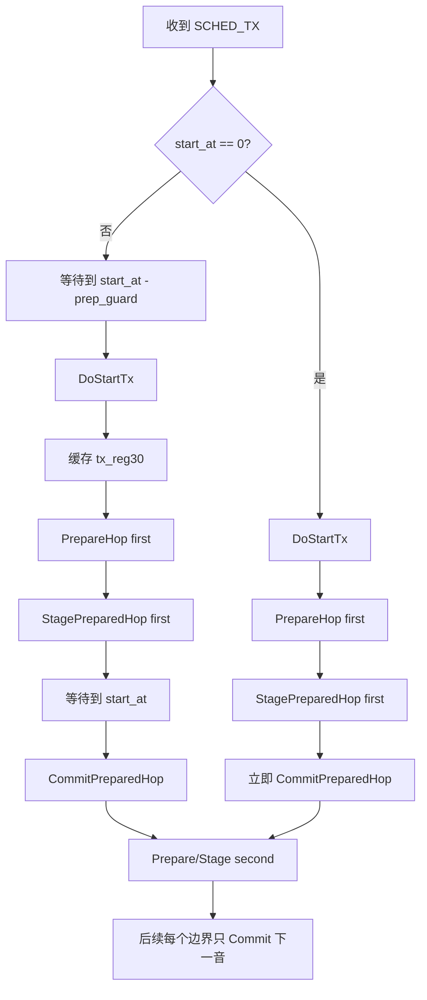

# k5-v5 Digimode Vernier缓存与激进时序优化计划

> 本文档是**独立计划**。阅读者不需要知道任何聊天记录，也不需要假设当前代码是谁写的。本文仅基于仓库中可见代码与文档，描述问题、约束、目标、实施步骤、验证方法与回退条件。

## 1. 适用范围

- 目标工程：`k5-v5`
- 目标模块：`../app/digmode.c`、`../dsp/vernier.c`、`../driver/bk4819.c`
- 目标场景：Digimode 发射路径，包括
  - `SCHED_TX` / `SCHED_APPEND` 计划播放
  - 旧单音 / 流式 `SET_FREQ` 接口
- 非目标：
  - 非 Digimode 的普通 FM / AM / USB / CW 路径
  - 改动主机协议格式
  - 改动 Vernier 的数学求解结果

## 2. 当前实现摘要

当前 `ApplyFreq(freq_dhz)` 在真正切频时会一次性完成以下动作：

1. 计算 `coarse_steps = freq_dhz / 100`
2. 计算 `fine_dhz = freq_dhz % 100`
3. 取得 Vernier 结果（缓存命中或调用 `VERNIER_Solve()`）
4. 写 `REG_38/39`
5. 写 `REG_3B`
6. 读 `REG_30`
7. `REG_30 = 0`
8. `REG_30 = 原值`

也就是说，当前关键路径是：

`等待目标时刻 -> 计算/取缓存 -> 写寄存器 -> toggle REG_30 -> 频率真正跳变`

在 `DIGMODE_Poll()` 的 `SCHED_TX` 与流式 FIFO 两条路径中，都是先等待到目标时刻，再调用 `ApplyFreq()`。因此当前时序属于：

`等待 -> 准备 -> 提交`

而不是：

`准备 -> 等待 -> 提交`

## 3. 已知硬件事实

仓库已有实测结论：**仅修改 `REG_38/39` 不会立即改变空口输出**，真正生效依赖 `REG_30` 的 VCO re-calibration 触发。

相关依据：

- `../../docs/LEARNING.md` 已记录：仅写 `REG_38/39` 时 PLL 继续锁在旧频率，必须 `toggle REG_30`
- `../driver/bk4819-regs.h` 中 `REG_30` 明确包含 `ENABLE_VCO_CALIB`
- `../app/digmode.c` 当前也使用 `REG_30 = 0` 后恢复原值来触发换频

## 4. 问题定义

### 4.1 CPU 时序问题

Digimode 的目标不是“平均吞吐量高”，而是“**边界时刻准**”。当前实现把计算和寄存器写都放在边界之后执行，因此：

- 第一音会晚于 `start_at`
- 每个符号边界都包含一次软件执行时间
- 即使 Vernier 缓存命中，仍然要在边界时刻做多次寄存器 I/O

### 4.2 现有缓存还不够

当前 Vernier 缓存已经是按需懒计算，但它只优化了**数学求解**，没有优化**寄存器提交时序**。

因此当前仍然会出现：

- `Vernier` 快了
- 但“真正触发 RF 跳变”的时刻仍然偏后

## 5. 优化目标

### 5.1 必须满足

- Vernier 数学结果与现有 `VERNIER_Solve()` **完全一致**
- 缓存仍然是**懒计算**，而不是切基频后立刻全表预热
- 支持 `SCHED_TX`、`SCHED_APPEND`、流式 `SET_FREQ`
- 明确处理**第一音**与**旧单音协议**
- 当基频改变导致 `alpha` 改变时，缓存自动失效

### 5.2 时序目标

把关键路径从：

`等待 -> 计算 -> 写寄存器 -> toggle`

调整为：

`计算/写寄存器 -> 等待 -> toggle`

最终让真正的符号边界只保留 `REG_30` 触发动作。

## 6. 核心设计

### 6.1 Vernier 缓存保留，且不能丢

缓存仍然必须保留。原因：

- Digimode 的 `freq_dhz` 最终只会映射到 `fine_dhz = freq_dhz % 100`
- 也就是 `< 10 Hz` 的 100 个细分槽位
- 对数字模式而言，很多细分频点会反复出现
- 每个细分点第一次命中时做一次 `VERNIER_Solve()`，之后直接复用，CPU 收益明显

缓存键值定义：

- 主键 1：`alpha_mhz`
- 主键 2：`fine_dhz`（0..99）

缓存失效条件：

- **仅当 `alpha_mhz` 变化时**整表失效

注意：

- `base_freq` 变了，不一定意味着 `alpha_mhz` 变了
- 因此缓存应按 `alpha_mhz` 管理，而不是机械地按 `base_freq` 全量重建

建议的缓存布局：

- `VernierEntry[100]`
- `valid bitmap`，只用位图记录 100 个槽位是否已填充

这样可以同时满足：

- 数学结果完全复用
- 首次不必全表预热
- RAM 明显小于“100 字节有效标志 + 额外临时表”的做法

### 6.2 分离“准备”和“提交”

现有 `ApplyFreq()` 需要拆成两个阶段：

#### 阶段 A：PrepareHop

输入：

- `base_freq_10hz`
- `base_3b`
- `freq_dhz`

输出：

- `pll_freq`
- `reg3b`
- `freq_dhz`

PrepareHop 负责：

1. 计算 `coarse_steps`
2. 查询/填充 Vernier 缓存
3. 计算 `pll_freq`
4. 计算 `reg3b`

但**不触发**换频。

#### 阶段 B：StagePreparedHop

把下一跳频点的“待生效寄存器”写入芯片，但**不打 `REG_30` 触发沿**：

- 写 `REG_38`
- 写 `REG_39`
- 写 `REG_3B`

此阶段目标是“把下一跳频点先装进去，但 RF 仍保持当前输出”。

#### 阶段 C：CommitPreparedHop

到了真正边界时，只执行：

1. `REG_30 = 0`
2. `REG_30 = tx_reg30_cached`

让“真正生效”的动作尽量短。

### 6.3 缓存 `tx_reg30_cached`

当前 `ApplyFreq()` 每次切频都会先 `ReadRegister(REG_30)`。这会把一次读寄存器放进关键路径。

优化后应在 TX 链路稳定后缓存一次：

- `sTxReg30Cached = BK4819_ReadRegister(BK4819_REG_30);`

然后每个 hop 只用：

- `WriteRegister(REG_30, 0);`
- `WriteRegister(REG_30, sTxReg30Cached);`

这样边界时刻不再需要额外读寄存器。

### 6.4 准备态缓存（Prepared Hop）

需要新增一个“已准备但尚未提交”的状态结构，至少包含：

- `valid`
- `freq_dhz`
- `pll_freq`
- `reg3b`

建议命名示例：

- `sPreparedHopValid`
- `sPreparedFreqDhz`
- `sPreparedPllFreq`
- `sPreparedReg3b`

如果将来想做双缓冲，可进一步扩展为 `current` / `next` 两套结构；但第一版单个 prepared slot 已足够。

## 7. 激进方案的关键假设与回退条件

### 7.1 激进假设

本计划的激进版假设：

- `REG_38/39` 可以提前写，直到 `REG_30` toggle 才真正生效
- `REG_3B` 也可以提前写，直到 `REG_30` toggle 才真正体现在 RF 输出上

已知第一条已有实测依据；第二条必须在实施后用 SDR 再确认。

### 7.2 如果 `REG_3B` 不能安全预装

若实测发现：

- 提前写 `REG_3B` 会立刻改变当前发射频率

则回退为“半激进方案”：

- `PrepareHop` 仍然提前完成
- `REG_38/39` 仍可提前写
- `REG_3B` 延后到 commit 时再写
- 边界时刻执行：
  - 写 `REG_3B`
  - `REG_30 = 0`
  - `REG_30 = cached`

这样仍然能把 Vernier 求解和一部分寄存器 I/O 挪出关键路径。

## 8. 第一音与旧单音协议的特殊处理

### 8.1 第一音不能在 `DoStartTx()` 之前预装

`DoStartTx()` 会复用正常的 CW 发射建立流程。该流程可能会重新配置 BK4819 的 TX 相关寄存器。

因此：

- **第一音的预装必须发生在 `DoStartTx()` 之后**
- 不能在 `DoStartTx()` 之前先写入 `REG_38/39`、`REG_3B` 并期望它们保持不变

### 8.2 `SCHED_TX` 第一音

对于 `SCHED_TX(start_at > 0)`：

1. 收到计划后，先只保存队列与 `start_at`
2. 当时间到达 `start_at - DIGMODE_TX_PREP_GUARD_US`：
   - 调用 `DoStartTx(base_freq, power)`
   - 缓存 `sTxReg30Cached`
   - `PrepareHop(first_freq)`
   - `StagePreparedHop(first_freq)`
   - 进入“等待第一音提交”状态
3. 当时间到达 `start_at`：
   - `CommitPreparedHop()`
   - 第一音生效
4. 第一音生效后，立即开始准备第二音

其中 `DIGMODE_TX_PREP_GUARD_US` 不应拍脑袋设定，建议定义为：

- `DoStartTx`
- `读取并缓存 REG_30`
- `PrepareHop(first)`
- `StagePreparedHop(first)`

这一整段在目标硬件上的**最坏执行时间**，再加少量安全余量。

对于 `SCHED_TX(start_at == 0)`：

- 无法获得额外的“等待窗口”
- 只能：
  - `DoStartTx()`
  - `PrepareHop(first_freq)`
  - `StagePreparedHop(first_freq)`
  - 立即 `CommitPreparedHop()`

也就是说，**立即开始的第一音仍然会承担一次准备成本**；但之后的音可以进入流水线。

### 8.3 旧单音 / 流式 `SET_FREQ`

流式 `SET_FREQ` 也必须区分：

#### 情况 A：`apply_at` 在未来

当某条 FIFO 头部已经进入“可准备窗口”时：

1. 先 `PrepareHop(freq)`
2. `StagePreparedHop(freq)`
3. 等待到 `apply_at`
4. `CommitPreparedHop()`

“可准备窗口”建议与 `DIGMODE_TX_PREP_GUARD_US` 使用同一套预算逻辑，而不是写死为某个拍脑袋的常数。

#### 情况 B：`apply_at <= now`

说明这次已经来不及提前等待：

1. `PrepareHop(freq)`
2. `StagePreparedHop(freq)`
3. 立即 `CommitPreparedHop()`

因此旧单音协议也能使用激进方案，只是**第一个来不及预装的音**仍会承担一次准备时间。

## 9. 推荐状态机

建议把当前逻辑明确拆成以下状态：

- `IDLE`
- `TX_ACTIVE_UNARMED`
- `TX_ACTIVE_ARMED`
- `SCHED_WAIT_PREP`
- `SCHED_WAIT_COMMIT`
- `SCHED_RUNNING`

推荐时序如下：

## 10. 代码改动点

### 10.1 `../app/digmode.c`

需要新增或重构的职责：

- Vernier 缓存仍保留为懒计算
- `GetVernierEntry(base_freq, fine_dhz)` 内部自动检查 `alpha`
- 新增 `PrepareHop`
- 新增 `StagePreparedHop`
- 新增 `CommitPreparedHop`
- 新增 prepared-hop 状态
- 新增 `sTxReg30Cached`
- `SCHED_TX` 路径改成“先准备后提交”
- 流式 FIFO 路径改成“只要时间足够就提前 stage”

### 10.2 `../dsp/vernier.c`

- 不改求解公式
- 不改搜索空间
- 仍然使用完整穷举，保证结果一致

### 10.3 `../../docs/LEARNING.md`

在实机验证后，补记以下结果：

- `REG_3B` 是否可以安全预装
- `REG_30` 提交沿与 SDR 观察到的 RF 跳变延迟
- 第一音 `start_at` 误差是否显著改善

## 11. 细节约束

### 11.1 Prepared hop 的生命周期

以下事件必须清空 prepared state：

- `DoStopTx()`
- `base_freq` 变化且 staged 内容对应旧基频
- CRC 连续失败导致的强制停发
- schedule 被新的 `SCHED_TX` 覆盖

### 11.2 Vernier 缓存与 prepared hop 不是一回事

两者不要混淆：

- **Vernier 缓存**：按 `alpha + fine_dhz` 复用数学结果
- **prepared hop**：按“下一跳待提交频点”保存已经写入/待写入的寄存器值

即使 `alpha` 没变、Vernier 缓存能复用，prepared hop 也必须按每次目标频率重新构造。

### 11.3 空 `SCHED_TX` 的作用

`N == 0` 的 `SCHED_TX` 仍然只负责：

- 切换 `base_freq`
- 更新 RX 频率
- 不进入 TX

它可以用于主机侧“先把基频切好”，但**不能代替第一音在 TX 建立后所需的 staged/commit 处理**。

## 12. 验证计划

### 12.1 编译验证

- 修改后通过 `ENABLE_DIGMODE=1 ENABLE_UART=1` 编译
- 以 Gitea Actions 或 Docker 构建为准

### 12.2 SDR 实机验证

#### 必做

1. 验证提前写 `REG_38/39` 时，空口频率不变化
2. 验证提前写 `REG_3B` 时，空口频率是否仍不变化
3. 验证 `start_at` 第一音边界是否明显提前
4. 验证流式 `SET_FREQ` 的 future `apply_at` 是否可以做到“先 stage，后 commit”
5. 验证重复细分频点是否只在首次出现时有额外 CPU 开销

#### 建议记录

- `start_at` 到 RF 真实跳变的误差
- 后续音边界抖动
- immediate start 与 deferred start 的差异
- 第一音与后续音的误差分布

## 13. 实施顺序建议

建议分 4 步做，便于回归：

1. 保留现有懒缓存，先把 `ApplyFreq()` 拆成 `PrepareHop/Stage/Commit`
2. 先实现“半激进版”：
   - 提前计算
   - 提前写 `REG_38/39`
   - commit 时再写 `REG_3B + REG_30`
3. 用 SDR 确认 `REG_3B` 是否也能提前写
4. 若确认安全，再升级到“全激进版”：
   - 提前写 `REG_38/39 + REG_3B`
   - 边界只保留 `REG_30` toggle

## 14. 结论

本计划的核心不是“把 Vernier 算法改快”，而是把 Digimode 换频链路改成两层：

- **数学层**：按 `alpha + fine_dhz` 做懒缓存，保证重复频点几乎不再付求解成本
- **时序层**：把寄存器准备移到边界之前，把真正的频率提交压缩成 `REG_30` 的触发动作

只要实测确认 `REG_3B` 可以像 `REG_38/39` 一样预装而不提前影响空口，激进方案就是当前仓库里最值得做的时序优化方向。
